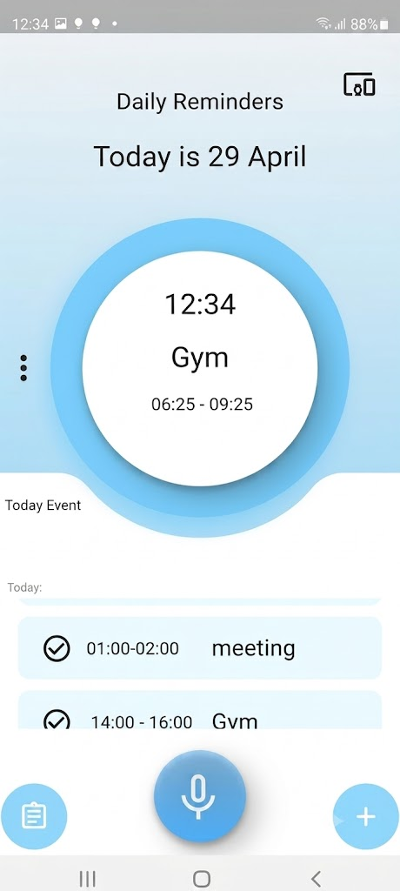
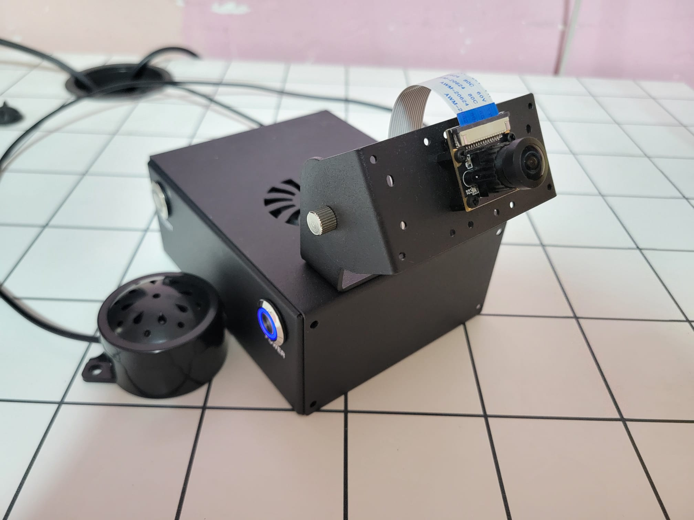
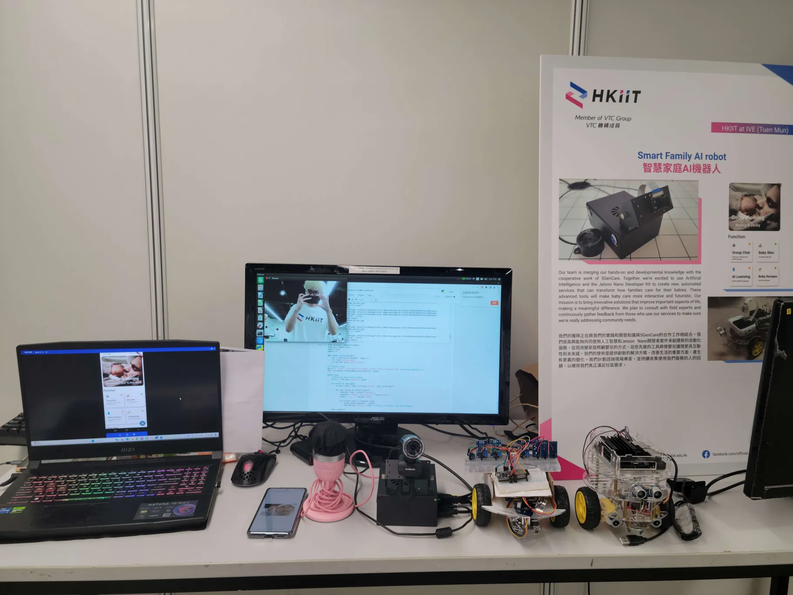

# 👵🏻 Elderly Care Edge Assistant (LAADR)

> **Final Year Project (Higher Diploma)**
> An Edge AI caregiver system designed to support the daily lives of the elderly. This project integrates a **Flutter mobile application** with a **Jetson Nano Edge AI backend**, offering voice-controlled scheduling, real-time facial recognition, intruder alerts, and automated daily reminders.

<p align="center">
  
  &nbsp;&nbsp;&nbsp;&nbsp;
  
</p>

## 📖 Project Overview

**LAADR (Life Assistant and Daily Reminders)** aims to bridge the gap between caregivers and elderly users by providing an intelligent, hands-free assistant. The system allows caregivers to remotely manage daily schedules via a mobile app, while the Jetson Nano edge device sits in the elderly person's home to broadcast reminders, monitor the environment, and provide security through facial recognition.

This project demonstrates strong system integration skills, combining **Mobile Development (Flutter)**, **Edge Computing & Computer Vision (Jetson Nano, OpenCV)**, and **Cloud Backend (Firebase)** into a cohesive IoT solution.

---

## � Exhibition & Live Demo

This project was successfully exhibited at the HKIIT (Member of VTC Group) Final Year Project exhibition, demonstrating a complete, working IoT hardware and software ecosystem.

<p align="center">
  
</p>
<p align="center">
  <em>Live demonstration of the Smart Family AI Robot ecosystem, showcasing the Jetson Nano, camera setup, and real-time inference monitoring alongside the mobile application.</em>
</p>

---

## �🌟 Core Functionalities & System Architecture

### 📱 Mobile Application (`lib/` - Flutter)
The mobile app acts as the caregiver's control center and the primary interface for remote management.

*   **Voice-Activated Scheduling (NLP):** Integrates **Picovoice (Porcupine + Rhino)** for offline, natural language understanding. Caregivers can simply say commands like *"Set a reminder for 3 PM"* to automatically parse intents and save events to the cloud.
*   **Real-Time Data Synchronization:** Uses **Firebase Realtime Database** to instantly sync schedules, events, and reminders between the mobile app and the edge device.
*   **Family Face Registration:** Caregivers can capture and upload photos of family members to **Firebase Storage**. These images are used to remotely trigger model training on the edge device.
*   **Push Notifications (FCM):** Receives instant alert notifications when the edge device detects an unrecognized person.

### 🧠 Edge AI Backend (`edge/` - Jetson Nano & Python)
The Jetson Nano serves as the brain of the smart home, executing resource-intensive tasks locally for low latency and high privacy.

*   **Socket-based Device Control (`socket_server.py`):** 
    *   Listens for TCP socket commands from the mobile app to receive image data, initiate facial recognition training, and control the camera feed.
    *   **Live Intruder Detection:** Uses **OpenCV** and `face_recognition` to process camera streams in real-time. If an unknown face is detected, it triggers a hardware GPIO alarm, captures an image, and sends an FCM push notification to the caregiver.
*   **Automated Voice Reminders (`reminder_service.py`):** 
    *   Continuously polls the Firebase Realtime Database for upcoming events. 
    *   When an event is due, it uses **gTTS (Google Text-to-Speech)** to broadcast localized audio reminders (e.g., *"Owner, you have a meeting at 14:00"*) directly into the room.
*   **Edge Voice Assistant (`voice_assistant.py`):** 
    *   A localized Picovoice agent running on the Jetson Nano.
    *   Can answer queries (like fetching real-time weather data from the Hong Kong Observatory API) and trigger local IoT actions.

---

## 🛠 Tech Stack

| Domain | Technologies Used |
| :--- | :--- |
| **Frontend (Mobile)** | Flutter, Dart |
| **Edge AI & IoT** | Python, Nvidia Jetson Nano, OpenCV, `face_recognition`, GPIO |
| **Cloud & Backend** | Firebase (Realtime Database, Storage), Firebase Cloud Messaging (FCM), TCP Sockets |
| **Voice & NLP** | Picovoice (Porcupine Wake Word, Rhino NLU), gTTS |

---

## 📁 Repository Structure

```text
├── lib/                     # Flutter App source code
│   ├── AI_asstesst.dart     # Picovoice Rhino NLP integration for voice commands
│   ├── home.dart            # Main dashboard UI and Firebase event listener
│   ├── Family.dart          # Face registration & Firebase Storage integration
│   └── ...
├── edge/                    # Jetson Nano Python services
│   ├── socket_server.py     # TCP server for remote commands & live face recognition
│   ├── reminder_service.py  # Firebase polling & gTTS audio broadcasting
│   ├── voice_assistant.py   # Local wake-word assistant & Weather API integration
│   └── gpio_controller.py   # Hardware alarm control
└── docs/                    # Architecture UML & Sequence diagrams
```

---

## 🚀 Quick Start Guide

### Mobile App Setup (Flutter)
1. Clone the repository and navigate to the project root.
2. Configure environment secrets:
   ```bash
   cp lib/config/secrets.example.dart lib/config/secrets.dart
   # Insert your Picovoice AccessKey in secrets.dart
   ```
3. Install dependencies and run:
   ```bash
   flutter pub get
   flutter run
   ```

### Edge Device Setup (Jetson Nano)
1. Ensure OpenCV and system dependencies are installed on your Jetson Nano.
2. Navigate to the edge folder and setup the environment:
   ```bash
   cd edge
   cp .env.example .env
   # Update environment variables (Firebase path, Socket IP, etc.)
   pip install -r requirements.txt
   ```
3. Start the edge services:
   ```bash
   # Run in separate terminal sessions or as background services
   python socket_server.py
   python reminder_service.py
   ```
